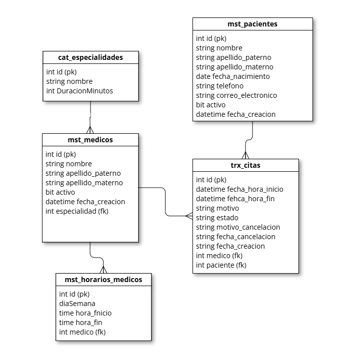

# Agenda Médica API

API REST en .NET para gestionar médicos, pacientes, horarios y citas.  
La base de datos está en SQL Server y las migraciones se manejan con Flyway.

## Requisitos

- .NET SDK 10
- SQL Server (local o remoto)
- Flyway CLI
- Postman (opcional, para pruebas manuales)

## Ejecutar el proyecto

### 1) Crear base de datos manualmente (paso inicial)

Ejecuta este script en SQL Server:

```sql
IF DB_ID('AgendaMedicaDB_DEV') IS NULL
BEGIN
    CREATE DATABASE [AgendaMedicaDB_DEV];
END
GO

USE [AgendaMedicaDB_DEV];
GO
```

### 2) Configurar conexión de la API

Edita la cadena en [appsettings.json](file:///c:/Users/angel.gaxiola/Documents/angel/agenda-medica/AgendaMedica/appsettings.json):

```json
"ConnectionStrings": {
  "AgendaMedica": "Server=TU_SERVER,1433;Database=AgendaMedicaDB_DEV;User Id=TU_USER;Password=TU_PASSWORD;TrustServerCertificate=True"
}
```

### 3) Configurar Flyway

Usa [flyway.conf.template](file:///c:/Users/angel.gaxiola/Documents/angel/agenda-medica/flyway.conf.template) como base y crea `flyway.conf` en la raíz:

```properties
flyway.url=jdbc:sqlserver://localhost:1433;databaseName=AgendaMedicaDB_DEV;encrypt=true;trustServerCertificate=true
flyway.user=TU_USER
flyway.password=TU_PASSWORD
flyway.locations=filesystem:./db/migrations,filesystem:./db/seed/dev
```

### 4) Ejecutar migraciones

Desde la raíz del repo:

```bash
flyway migrate
```

### 5) Levantar API

```bash
cd AgendaMedica
dotnet run
```

Por defecto la API está en `http://localhost:5022` (según tu configuración actual).

## Probar con Postman

- Colección: [AgendaMedica.postman_collection.json](file:///c:/Users/angel.gaxiola/Documents/angel/agenda-medica/AgendaMedica.postman_collection.json)
- Guía completa: [POSTMAN.md](file:///c:/Users/angel.gaxiola/Documents/angel/agenda-medica/POSTMAN.md)

Pasos rápidos:

1. Importar `AgendaMedica.postman_collection.json` en Postman.
2. Verificar que `base_url` sea `http://localhost:5022`.
3. Ejecutar por carpetas (`Medicos`, `Horarios`, `Pacientes`, `Citas`).
4. Para reglas de negocio de citas, usar `Reglas Citas con datos seed`.

## Unit Tests

El proyecto de pruebas está en:

- [AgendaMedica.Tests.csproj](file:///c:/Users/angel.gaxiola/Documents/angel/agenda-medica/AgendaMedica.Tests/AgendaMedica.Tests.csproj)
- Tests actuales de reglas de citas: [CitasRulesTests.cs](file:///c:/Users/angel.gaxiola/Documents/angel/agenda-medica/AgendaMedica.Tests/Controllers/CitasRulesTests.cs)

Ejecutar todos los tests:

```bash
dotnet test .\AgendaMedica.Tests\AgendaMedica.Tests.csproj
```

Qué cubren los tests actuales:

- conflicto de horario con respuesta `409`,
- sugerencias de horario en conflicto,
- caso sin sugerencias (lista vacía),
- validación de duración por especialidad en respuesta,
- alerta de cancelaciones (`3+` en últimos 30 días).

## Estructura de base de datos

### Tablas principales

- `cat_especialidades`: catálogo de especialidades y duración en minutos.
- `mst_medicos`: médicos activos/inactivos.
- `mst_horarios_medico`: horario semanal por médico.
- `mst_pacientes`: pacientes activos/inactivos.
- `trx_citas`: transacciones de citas.

### Diagrama ER


Si no se muestra en tu visor, puedes abrirla directo aquí: [er-diagram.png](file:///c:/Users/angel.gaxiola/Documents/angel/agenda-medica/er-diagram.png)

## Decisiones de diseño

- Reglas de negocio críticas en SQL (Stored Procedures) para mantener consistencia.
- API delgada en controladores/servicios con Dapper para mapear resultados.
- Eliminación lógica en entidades maestras (`mst_medicos`, `mst_pacientes`).
- Reglas de citas en SP:
  - sin simultaneidad de médico,
  - duración por especialidad,
  - validación de horario,
  - sin citas pasadas,
  - alerta por cancelaciones recientes.
- Sugerencia de horarios separada para consumo explícito por API.

## Documentación adicional

- [POSTMAN.md](file:///c:/Users/angel.gaxiola/Documents/angel/agenda-medica/POSTMAN.md)
- [MIGRACION.md](file:///c:/Users/angel.gaxiola/Documents/angel/agenda-medica/MIGRACION.md)
- [DELPHI.md](file:///c:/Users/angel.gaxiola/Documents/angel/agenda-medica/DELPHI.md)
- [POR_MEJORAR.md](file:///c:/Users/angel.gaxiola/Documents/angel/agenda-medica/POR_MEJORAR.md)
